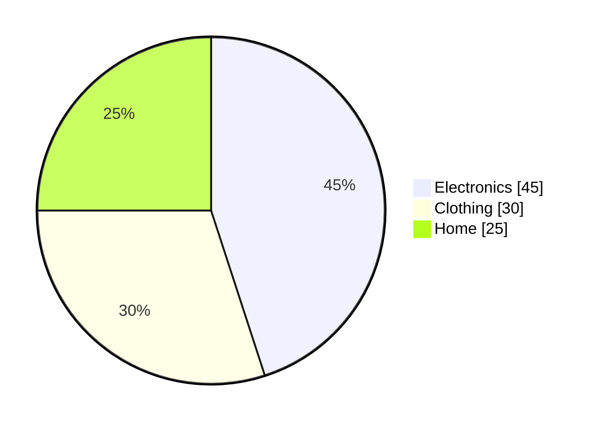
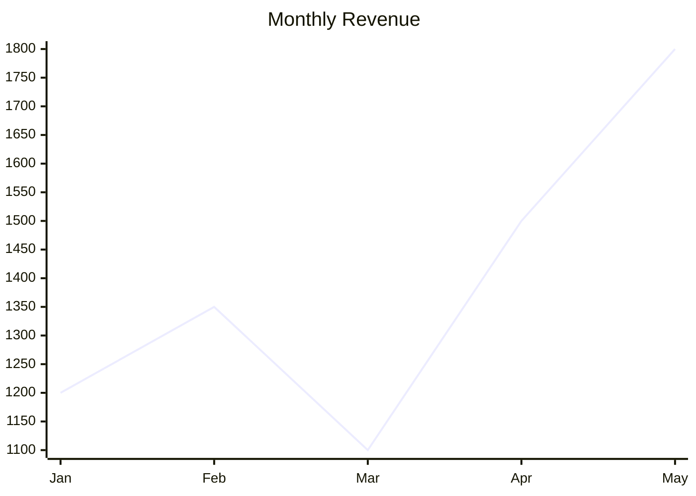

# Mini-MCP API Reference

Complete reference for all MCP tools provided by Mini-MCP.

## Tools Overview

| Tool             | Description                 | Returns        |
| ---------------- | --------------------------- | -------------- |
| `load_data`      | Load file into DuckDB table | Table metadata |
| `query_data`     | Execute SQL or NL query     | Query results  |
| `describe_data`  | Get table statistics        | Schema + stats |
| `list_tables`    | List loaded tables          | Table list     |
| `export_data`    | Export to format            | Formatted data |
| `visualize_data` | Generate charts             | Chart output   |

---

## `load_data`

Load a data file into an in-memory DuckDB table.

### Parameters

| Parameter   | Type   | Required | Description                           |
| ----------- | ------ | -------- | ------------------------------------- |
| `filePath`  | string | ✅       | Path to the data file                 |
| `tableName` | string | ❌       | Custom table name (default: filename) |

### Supported Formats

| Format  | Extensions        | Parser                         |
| ------- | ----------------- | ------------------------------ |
| CSV     | `.csv`            | csv-parse with auto-delimiter  |
| TSV     | `.tsv`            | csv-parse with tab delimiter   |
| JSON    | `.json`           | Native JSON (array of objects) |
| JSONL   | `.jsonl`          | Line-delimited JSON            |
| Parquet | `.parquet`, `.pq` | DuckDB native                  |

### Response

```typescript
interface LoadDataResult {
	success: boolean;
	tableName: string;
	rowCount: number;
	columns: ColumnInfo[];
	message: string;
}

interface ColumnInfo {
	name: string;
	type:
		| "VARCHAR"
		| "INTEGER"
		| "BIGINT"
		| "DOUBLE"
		| "BOOLEAN"
		| "DATE"
		| "TIMESTAMP";
	nullable: boolean;
}
```

### Examples

```javascript
// Basic load
load_data({ filePath: "./data/sales.csv" });
// → Table 'sales' created: 1500 rows, 8 columns

// Custom table name
load_data({ filePath: "./data/2024-q1.csv", tableName: "q1_sales" });
// → Table 'q1_sales' created: 500 rows, 8 columns

// JSON array
load_data({ filePath: "./customers.json" });
// → Table 'customers' created: 200 rows, 5 columns
```

### Errors

| Error                | Cause                     |
| -------------------- | ------------------------- |
| `Path not allowed`   | File outside allowedPaths |
| `File too large`     | Exceeds maxFileSizeMB     |
| `Unsupported format` | Unknown file extension    |
| `Max tables reached` | Exceeds maxTablesLoaded   |

---

## `query_data`

Execute SQL queries or natural language questions.

### Parameters

| Parameter   | Type   | Required | Description                            |
| ----------- | ------ | -------- | -------------------------------------- |
| `query`     | string | ✅       | SQL query or natural language          |
| `tableName` | string | ❌       | Target table (required for NL queries) |

### Response

```typescript
interface QueryResult {
	columns: string[];
	rows: (string | number | boolean | null)[][];
	rowCount: number;
	truncated: boolean;
	sql?: string; // Generated SQL (for NL queries)
}
```

### SQL Query Examples

```javascript
// Basic SELECT
query_data({ query: "SELECT * FROM sales LIMIT 10" });

// Aggregation
query_data({
	query: "SELECT region, SUM(amount) as total FROM sales GROUP BY region",
});

// JOIN
query_data({
	query: `
    SELECT c.name, COUNT(o.id) as orders
    FROM customers c
    LEFT JOIN orders o ON c.id = o.customer_id
    GROUP BY c.name
  `,
});

// Window functions
query_data({
	query: `
    SELECT product, amount,
           SUM(amount) OVER (ORDER BY date) as running_total
    FROM sales
  `,
});
```

### Natural Language Examples

```javascript
// Show all data
query_data({ query: "show all", tableName: "sales" });
// → SELECT * FROM sales

// Top N
query_data({ query: "top 10 by revenue", tableName: "sales" });
// → SELECT * FROM sales ORDER BY revenue DESC LIMIT 10

// Count by category
query_data({ query: "count by region", tableName: "sales" });
// → SELECT region, COUNT(*) FROM sales GROUP BY region

// Aggregation
query_data({ query: "total sales by month", tableName: "sales" });
// → SELECT month, SUM(sales) FROM sales GROUP BY month

// Filtering
query_data({ query: "where amount > 1000", tableName: "sales" });
// → SELECT * FROM sales WHERE amount > 1000
```

### Blocked SQL Keywords

The following keywords are **always blocked** (hardcoded security):

```
DROP, DELETE, TRUNCATE, ALTER, CREATE, INSERT, UPDATE,
ATTACH, DETACH, EXEC, EXECUTE, PRAGMA, VACUUM, REINDEX
```

---

## `describe_data`

Get schema and statistics for a loaded table.

### Parameters

| Parameter   | Type   | Required | Description       |
| ----------- | ------ | -------- | ----------------- |
| `tableName` | string | ✅       | Name of the table |

### Response

```typescript
interface DescribeResult {
	tableName: string;
	rowCount: number;
	columnCount: number;
	columns: ColumnStats[];
}

interface ColumnStats {
	name: string;
	type: string;
	nullCount: number;
	distinctCount: number;
	min?: number | string;
	max?: number | string;
	mean?: number; // Numeric columns only
	stddev?: number; // Numeric columns only
}
```

### Example Output

```
describe_data({ tableName: "sales" })

→ Table: sales (1500 rows, 8 columns)

| Column   | Type    | Nulls | Distinct | Min    | Max       | Mean    |
|----------|---------|-------|----------|--------|-----------|---------|
| id       | INTEGER | 0     | 1500     | 1      | 1500      | 750.5   |
| date     | DATE    | 0     | 365      | 2024-01| 2024-12   | -       |
| product  | VARCHAR | 0     | 45       | -      | -         | -       |
| amount   | DOUBLE  | 12    | 890      | 10.50  | 9999.99   | 245.30  |
| region   | VARCHAR | 0     | 3        | -      | -         | -       |
```

---

## `list_tables`

List all currently loaded tables.

### Parameters

None.

### Response

```typescript
interface ListTablesResult {
	tables: TableInfo[];
	count: number;
}

interface TableInfo {
	name: string;
	rowCount: number;
	columnCount: number;
	filePath: string;
	loadedAt: string; // ISO timestamp
}
```

### Example

```
list_tables()

→ 3 tables loaded:
  • sales (1500 rows, 8 cols) - ./data/sales.csv
  • customers (200 rows, 5 cols) - ./data/customers.json
  • products (45 rows, 4 cols) - ./data/products.csv
```

---

## `export_data`

Export query results or entire tables to various formats.

### Parameters

| Parameter  | Type   | Required | Description                       |
| ---------- | ------ | -------- | --------------------------------- |
| `source`   | string | ✅       | Table name or SQL query           |
| `format`   | string | ✅       | Output format                     |
| `filePath` | string | ❌       | Save to file (if readOnly: false) |

### Formats

| Format     | MIME Type            | Description            |
| ---------- | -------------------- | ---------------------- |
| `csv`      | text/csv             | RFC 4180 compliant     |
| `json`     | application/json     | Pretty-printed array   |
| `jsonl`    | application/x-ndjson | Line-delimited JSON    |
| `markdown` | text/markdown        | GitHub-Flavored tables |

### Examples

```javascript
// Export table as CSV
export_data({ source: "sales", format: "csv" });

// Export query as JSON
export_data({
	source: "SELECT * FROM sales WHERE region = 'North'",
	format: "json",
});

// Save to file (requires readOnly: false)
export_data({
	source: "customers",
	format: "csv",
	filePath: "./exports/customers.csv",
});
```

### Output Examples

**CSV:**

```csv
id,name,amount
1,"Widget A",199.99
2,"Widget B",299.99
```

**JSON:**

```json
[
	{ "id": 1, "name": "Widget A", "amount": 199.99 },
	{ "id": 2, "name": "Widget B", "amount": 299.99 }
]
```

**JSONL:**

```
{"id":1,"name":"Widget A","amount":199.99}
{"id":2,"name":"Widget B","amount":299.99}
```

**Markdown:**

```markdown
| id  | name     | amount |
| --- | -------- | ------ |
| 1   | Widget A | 199.99 |
| 2   | Widget B | 299.99 |
```

---

## `visualize_data`

Create chart visualizations from query results.

### Parameters

| Parameter     | Type   | Required | Description                         |
| ------------- | ------ | -------- | ----------------------------------- |
| `source`      | string | ✅       | Table name or SQL query             |
| `chartType`   | string | ✅       | Chart type or "auto"                |
| `format`      | string | ❌       | "ascii" (default) or "mermaid"      |
| `labelColumn` | string | ❌       | Column for labels (default: first)  |
| `valueColumn` | string | ❌       | Column for values (default: second) |

### Chart Types

| Type   | Best For             | ASCII | Mermaid |
| ------ | -------------------- | ----- | ------- |
| `bar`  | Comparing categories | ✅    | ✅      |
| `pie`  | Part-of-whole        | ✅    | ✅      |
| `line` | Time series          | ✅    | ✅      |
| `auto` | Let system decide    | ✅    | ✅      |

### Auto-Selection Logic

- **Time patterns** (dates, months, Q1-Q4) → `line`
- **Percentages** (sum ~100) → `pie`
- **Many categories** (>8) → `line`
- **Default** → `bar`

### Examples

```javascript
// ASCII bar chart
visualize_data({
	source: "SELECT region, SUM(amount) FROM sales GROUP BY region",
	chartType: "bar",
	format: "ascii",
});
```

Output:

```
   North │ ████████████████████████████████████████ 45230
   South │ ████████████████████████████████ 38120
  Center │ ██████████████████████████████████████████████ 52890
```

```javascript
// Mermaid pie chart
visualize_data({
	source: "SELECT category, COUNT(*) FROM products GROUP BY category",
	chartType: "pie",
	format: "mermaid",
});
```

Output:



```javascript
// Auto-select with time data
visualize_data({
	source: "SELECT month, revenue FROM monthly_sales",
	chartType: "auto",
	format: "mermaid",
});
```

Output:



---

## Error Responses

All tools return errors in a consistent format:

```typescript
{
  content: [{
    type: "text",
    text: "Error: <description>"
  }],
  isError: true
}
```

### Common Errors

| Error                              | Tool                      | Cause                     |
| ---------------------------------- | ------------------------- | ------------------------- |
| `Path not allowed`                 | load_data                 | File outside allowedPaths |
| `Table not found`                  | query_data, describe_data | Table not loaded          |
| `Security: blocked keyword`        | query_data                | Dangerous SQL detected    |
| `Visualization requires 2 columns` | visualize_data            | Need label + value        |
| `Query timed out`                  | query_data                | Exceeded queryTimeoutMs   |
