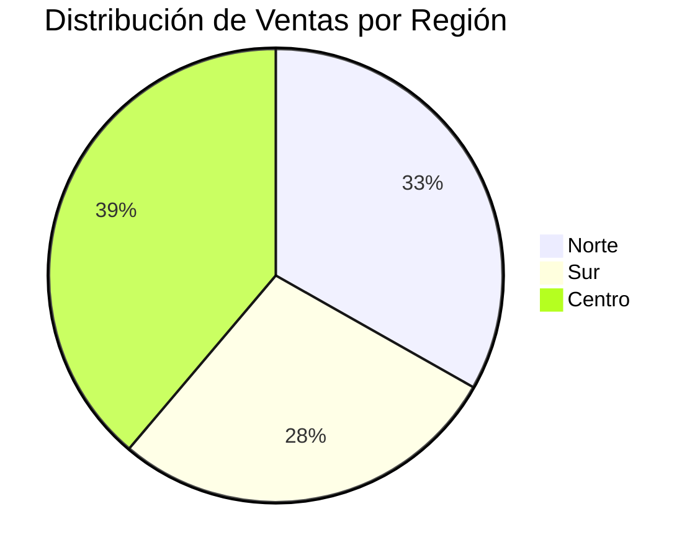
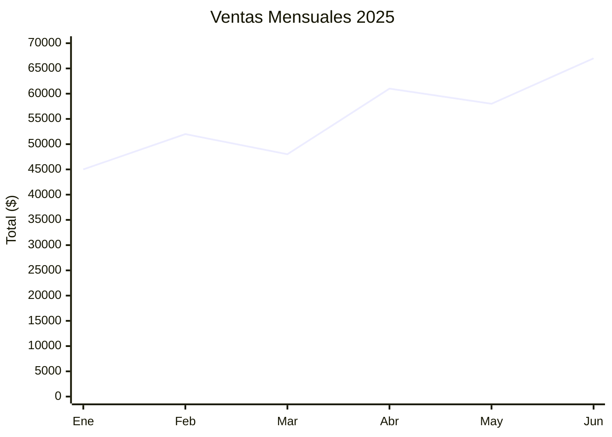

# Plan: Mini-MCP para Análisis de Datos con Lenguaje Natural

## 🎯 Objetivo

Crear un servidor MCP (Model Context Protocol) extensible, seguro y configurable que permita analizar archivos de datos (CSV, JSON, Parquet, etc.) mediante consultas SQL o lenguaje natural, usando **DuckDB** en memoria como motor de consultas analíticas.

---

## 🛡️ Principios de Diseño

| Principio             | Implementación                                    |
| --------------------- | ------------------------------------------------- |
| **Seguridad primero** | Read-only por defecto, operaciones limitadas      |
| **Configurable**      | Archivo de configuración para límites y permisos  |
| **Validación**        | Inferencia y validación de esquema antes de carga |
| **Límites claros**    | Máximo de filas, tamaño de salida, timeout        |
| **Extensible**        | Parsers/exporters modulares                       |

---

## 🏗️ Arquitectura

```
┌─────────────────────────────────────────────────────────────────────────────┐
│                            Mini-MCP Server                                  │
├─────────────────────────────────────────────────────────────────────────────┤
│                                                                             │
│  ┌─────────────────┐   ┌─────────────────┐                                  │
│  │     Config      │   │    Security     │                                  │
│  │  🟡 Configurable │   │  🔴 Hardcoded   │                                  │
│  │  (límites, rutas)│   │  (SQL, paths)   │                                  │
│  └────────┬────────┘   └────────┬────────┘                                  │
│           │                     │                                           │
│           └──────────┬──────────┘                                           │
│                      ▼                                                      │
│  ┌───────────────┐  ┌───────────────┐  ┌───────────────┐  ┌─────────────┐  │
│  │    Parsers    │  │    DuckDB     │  │   Exporters   │  │ Visualizers │  │
│  │ + Schema Inf. │─►│   (memoria)   │─►│   (salida)    │  │ ASCII/Merm. │  │
│  │   Validators  │  │   READ-ONLY   │  │ CSV,JSON,JSONL│  │             │  │
│  └───────────────┘  └───────┬───────┘  └───────────────┘  └─────────────┘  │
│         │                   │                   │               │           │
│    CSV, JSON,               │                   │               │           │
│    TSV, Parquet        ┌────┴────┐              │               │           │
│                        │   NLP   │◄─────────────┴───────────────┘           │
│                        │ NL→SQL  │                                          │
│                        └────┬────┘                                          │
│                             │                                               │
│                      ┌──────┴──────┐                                        │
│                      │    Tools    │                                        │
│                      │    (MCP)    │                                        │
│                      └─────────────┘                                        │
│                             │                                               │
│         load_data, query_data, describe_data, list_tables,                  │
│                    export_data, visualize_data                              │
│                                                                             │
└─────────────────────────────────────────────────────────────────────────────┘
```

### Flujo de transformación

```
  Entrada           Procesamiento            Salida
  ───────           ─────────────            ──────

  archivo.csv  ─┐                        ┌─► resultado.json
  datos.json   ─┼──► DuckDB ──► Query ───┼─► export.csv
  info.tsv     ─┘    (merge)    (SQL)    └─► stream.jsonl
```

### Ventajas de esta arquitectura

| Aspecto                 | Beneficio                                                               |
| ----------------------- | ----------------------------------------------------------------------- |
| **DuckDB**              | 10-100x más rápido que SQLite para agregaciones, soporte Parquet nativo |
| **Seguridad 3 niveles** | 🔴 Hardcoded + 🟡 Configurable + 🟢 Flexible                            |
| **Validación**          | Inferencia de esquema y reporte de calidad antes de cargar              |
| **Read-only**           | Seguro por defecto, sin modificaciones accidentales                     |
| **Extensible**          | Agregar formatos solo requiere nuevo parser/exporter                    |
| **Visualización**       | ASCII (terminal) + Mermaid (markdown) sin dependencias                  |
| **NLP → SQL**           | Consultas en lenguaje natural traducidas a SQL                          |

---

## 📋 Fases del Proyecto

### Fase 1: Configuración Base ✅

**Tiempo estimado: 1-2 horas** | **Estado: COMPLETADO**

- [x] Configurar TypeScript
- [x] Instalar dependencias (MCP SDK, DuckDB, parsers)
- [x] Configurar estructura de carpetas
- [x] Crear servidor MCP básico
- [x] Crear archivo de configuración por defecto

**Estructura propuesta:**

```
mini-mcp/
├── src/
│   ├── index.ts              # Punto de entrada del servidor MCP
│   ├── config/
│   │   ├── index.ts          # Carga y valida configuración
│   │   ├── schema.ts         # Schema Zod para config
│   │   ├── validator.ts      # Validación con advertencias
│   │   └── defaults.ts       # Valores por defecto
│   ├── security/
│   │   ├── hardcoded.ts      # 🔴 Protecciones NO configurables
│   │   └── enforcer.ts       # Aplicación de reglas de seguridad
│   ├── tools/
│   │   ├── load-data.ts      # Tool: cargar archivos
│   │   ├── query-data.ts     # Tool: consultas SQL/NL
│   │   ├── describe-data.ts  # Tool: estadísticas
│   │   ├── list-tables.ts    # Tool: listar tablas cargadas
│   │   ├── export-data.ts    # Tool: exportar/transformar datos
│   │   └── visualize-data.ts # Tool: visualizar datos
│   ├── parsers/
│   │   ├── index.ts          # Registry de parsers
│   │   ├── base-parser.ts    # Interface común
│   │   ├── csv-parser.ts     # Parser CSV/TSV
│   │   ├── json-parser.ts    # Parser JSON/JSONL
│   │   └── parquet-parser.ts # Parser Parquet (DuckDB nativo)
│   ├── validators/
│   │   ├── index.ts          # Validador principal
│   │   ├── schema-inferrer.ts # Inferencia de esquema
│   │   └── data-validator.ts  # Validación de datos vs esquema
│   ├── exporters/
│   │   ├── index.ts          # Registry de exporters
│   │   ├── base-exporter.ts  # Interface común
│   │   ├── csv-exporter.ts   # Exportar a CSV
│   │   ├── json-exporter.ts  # Exportar a JSON
│   │   └── jsonl-exporter.ts # Exportar a JSONL (streaming)
│   ├── visualizers/
│   │   ├── index.ts          # Registry de visualizers
│   │   ├── base-visualizer.ts # Interface común
│   │   ├── ascii-charts.ts   # Gráficos ASCII (barras, histogramas)
│   │   └── mermaid-charts.ts # Gráficos Mermaid (pie, bar, line)
│   ├── store/
│   │   └── data-store.ts     # Gestión de DuckDB en memoria (READ-ONLY)
│   ├── nlp/
│   │   └── query-builder.ts  # NL → SQL translator
│   └── types/
│       └── index.ts          # Definiciones de tipos
├── mini-mcp.config.json      # Configuración del servidor
├── mini-mcp.schema.json      # JSON Schema para validación de config
├── package.json
├── tsconfig.json
└── README.md
```

---

### Fase 2: Sistema de Configuración ✅

**Tiempo estimado: 2 horas** | **Estado: COMPLETADO**

- [x] Definir schema de configuración con Zod
- [x] Implementar carga de `mini-mcp.config.json`
- [x] Valores por defecto seguros
- [x] Validación al iniciar servidor con advertencias
- [x] Hardcodear protecciones críticas (no configurables)

#### Niveles de Seguridad

| Nivel        | Color | Configurable       | Descripción                                      |
| ------------ | ----- | ------------------ | ------------------------------------------------ |
| **Crítico**  | 🔴    | ❌ Nunca           | Hardcoded en código, previene daño irreversible  |
| **Sensible** | 🟡    | ⚠️ Con advertencia | Usuario puede cambiar, se muestra warning        |
| **Flexible** | 🟢    | ✅ Libremente      | Sin riesgo de seguridad, ajustar según necesidad |

#### 🔴 Protecciones HARDCODED (no en config)

```typescript
// src/security/hardcoded.ts
// ESTAS PROTECCIONES NO SON CONFIGURABLES - SIEMPRE ACTIVAS

export const ALWAYS_BLOCKED_SQL = [
	"DROP",
	"DELETE",
	"TRUNCATE",
	"ALTER",
	"CREATE",
	"INSERT",
	"UPDATE",
	"ATTACH",
	"DETACH",
	"EXEC",
	"EXECUTE",
	"PRAGMA",
	"VACUUM",
	"REINDEX",
];

export const ALWAYS_BLOCKED_PATHS = [
	"../", // Path traversal
	"..\\", // Path traversal Windows
	"/etc/passwd",
	"/etc/shadow",
	"~/.ssh",
	".env",
	".git",
];

export const SECURITY_RULES = {
	// Nombres de tabla sanitizados (solo alfanumérico y _)
	tableNameRegex: /^[a-zA-Z_][a-zA-Z0-9_]*$/,

	// Máximo absoluto de filas (incluso si config dice más)
	absoluteMaxRows: 10_000_000,

	// Máximo absoluto de archivo (incluso si config dice más)
	absoluteMaxFileSizeMB: 2048,
};
```

#### Archivo de configuración: `mini-mcp.config.json`

```json
{
	"$schema": "./mini-mcp.schema.json",

	// === 🟡 SEGURIDAD (configurable con advertencia) ===
	"security": {
		"readOnly": true, // ⚠️ false permite escribir archivos
		"allowedPaths": [
			// ⚠️ ampliar da más acceso al filesystem
			"./data",
			"/Users/*/Documents/data"
		],
		"blockedPaths": [
			// Rutas adicionales a bloquear (+ hardcoded)
			"/var",
			"/tmp"
		],
		"allowNetworkPaths": false, // ⚠️ true permite URLs http/https
		"maxFileSizeMB": 100 // ⚠️ mayor = más riesgo de memoria
	},

	// === 🟢 LÍMITES DE OUTPUT (libremente configurable) ===
	"limits": {
		"maxRowsInMemory": 1000000, // Máximo filas en una tabla
		"maxRowsOutput": 1000, // Máximo filas en respuesta de query
		"maxOutputChars": 50000, // Máximo caracteres en respuesta
		"maxTablesLoaded": 10, // Máximo tablas simultáneas
		"queryTimeoutMs": 30000, // Timeout para queries (30s)
		"maxChartDataPoints": 50 // Máximo puntos en visualizaciones
	},

	// === 🟢 OPERACIONES PERMITIDAS (libremente configurable) ===
	"operations": {
		"allowLoad": true, // Permitir cargar archivos
		"allowQuery": true, // Permitir queries SQL
		"allowNaturalLanguage": true, // Permitir NL → SQL
		"allowDescribe": true, // Permitir describe/stats
		"allowExport": false, // Requiere readOnly: false
		"allowVisualize": true // Permitir generar gráficos
	},

	// === 🟢 FORMATOS (libremente configurable) ===
	"formats": {
		"input": ["csv", "tsv", "json", "jsonl", "parquet"],
		"output": ["json", "csv", "jsonl"],
		"visualization": ["ascii", "mermaid"]
	},

	// === 🟢 DUCKDB (libremente configurable) ===
	"duckdb": {
		"memoryLimitMB": 512, // Límite de memoria para DuckDB
		"threads": 2 // Número de threads
	}
}
```

**Nota:** Los `blockedSQLKeywords` NO están en config porque son hardcoded.

#### Validación con Advertencias

```typescript
// src/config/validator.ts
import {
	ALWAYS_BLOCKED_PATHS,
	ALWAYS_BLOCKED_SQL,
} from "../security/hardcoded";

export function validateAndWarn(config: Config): ValidationResult {
	const warnings: string[] = [];
	const errors: string[] = [];

	// === ADVERTENCIAS (🟡 configuración sensible) ===

	if (!config.security.readOnly) {
		warnings.push(
			"⚠️  ADVERTENCIA: readOnly: false",
			"    El MCP puede escribir archivos en disco.",
			"    Asegúrese de que allowedPaths está correctamente configurado.",
		);
	}

	if (config.security.allowNetworkPaths) {
		warnings.push(
			"⚠️  ADVERTENCIA: allowNetworkPaths: true",
			"    El MCP puede acceder a URLs externas (http/https).",
			"    Esto podría exponer datos o permitir SSRF.",
		);
	}

	// Detectar paths muy amplios
	const dangerousPaths = config.security.allowedPaths.filter(
		(p) => p === "/" || p === "~" || p === "*" || p === "/**",
	);
	if (dangerousPaths.length > 0) {
		warnings.push(
			"⚠️  ADVERTENCIA: allowedPaths contiene rutas muy amplias",
			`    Paths: ${dangerousPaths.join(", ")}`,
			"    Esto da acceso a gran parte del filesystem.",
		);
	}

	if (config.security.maxFileSizeMB > 500) {
		warnings.push(
			"⚠️  ADVERTENCIA: maxFileSizeMB > 500MB",
			"    Archivos muy grandes pueden causar problemas de memoria.",
		);
	}

	// === VALIDACIÓN DE CONSISTENCIA ===

	if (config.operations.allowExport && config.security.readOnly) {
		errors.push(
			"❌ ERROR: allowExport: true requiere readOnly: false",
			"   Cambie readOnly a false o deshabilite allowExport.",
		);
	}

	// === OUTPUT ===

	if (warnings.length > 0) {
		console.warn("\n╔══════════════════════════════════════════╗");
		console.warn("║     ADVERTENCIAS DE CONFIGURACIÓN        ║");
		console.warn("╚══════════════════════════════════════════╝\n");
		warnings.forEach((w) => console.warn(w));
		console.warn(
			"\nEstas configuraciones son intencionales? (continúa en 3s...)\n",
		);
	}

	if (errors.length > 0) {
		console.error("\n❌ ERRORES DE CONFIGURACIÓN:");
		errors.forEach((e) => console.error(e));
		throw new Error("Configuración inválida. Corrija los errores.");
	}

	return { warnings, errors, isValid: errors.length === 0 };
}
```

#### Aplicación de Protecciones Hardcoded

```typescript
// src/security/enforcer.ts
import {
	ALWAYS_BLOCKED_SQL,
	ALWAYS_BLOCKED_PATHS,
	SECURITY_RULES,
} from "./hardcoded";

export class SecurityEnforcer {
	// Siempre bloquea estos SQL keywords, sin importar config
	validateSQL(sql: string): void {
		const upperSQL = sql.toUpperCase();
		for (const keyword of ALWAYS_BLOCKED_SQL) {
			// Buscar keyword como palabra completa
			const regex = new RegExp(`\\b${keyword}\\b`, "i");
			if (regex.test(upperSQL)) {
				throw new SecurityError(
					`SQL bloqueado: contiene '${keyword}'`,
					"BLOCKED_SQL_KEYWORD",
				);
			}
		}
	}

	// Siempre bloquea estos paths, sin importar config
	validatePath(path: string): void {
		for (const blocked of ALWAYS_BLOCKED_PATHS) {
			if (path.includes(blocked)) {
				throw new SecurityError(
					`Ruta bloqueada por seguridad: '${blocked}'`,
					"BLOCKED_PATH",
				);
			}
		}
	}

	// Sanitizar nombre de tabla
	sanitizeTableName(name: string): string {
		if (!SECURITY_RULES.tableNameRegex.test(name)) {
			// Limpiar caracteres no permitidos
			const sanitized = name.replace(/[^a-zA-Z0-9_]/g, "_");
			console.warn(`Nombre de tabla sanitizado: '${name}' → '${sanitized}'`);
			return sanitized;
		}
		return name;
	}
}
```

---

### Fase 3: DataStore con DuckDB ✅

**Tiempo estimado: 2-3 horas** | **Estado: COMPLETADO**

- [x] Configurar `@duckdb/node-api` (nuevo paquete oficial)
- [x] Implementar clase `DuckDBStore` READ-ONLY:
  - Crear tablas dinámicamente desde datos parseados
  - Detectar tipos de columnas (VARCHAR, INTEGER, DOUBLE, BOOLEAN, DATE, TIMESTAMP, BIGINT)
  - Ejecutar queries SQL con límites configurables
  - Listar tablas y esquemas (`getTableMetadata()`)
  - Obtener estadísticas (`getTableStats()`)
  - Aplicar límites de configuración
- [x] Validar SQL contra keywords permitidos/bloqueados
- [x] Manejar múltiples tablas simultáneas

**Nota:** Se usó `@duckdb/node-api` en lugar de `duckdb` por mejor soporte ESM.

```typescript
// src/store/data-store.ts
import * as duckdb from "duckdb";

class DataStore {
	private db: duckdb.Database;
	private config: Config;

	constructor(config: Config) {
		this.config = config;
		this.db = new duckdb.Database(":memory:", {
			max_memory: `${config.duckdb.memoryLimitMB}MB`,
			threads: config.duckdb.threads,
		});
	}

	// Crear tabla desde datos parseados
	async createTable(
		name: string,
		columns: ColumnDef[],
		data: any[],
	): Promise<void>;

	// Ejecutar query con validación y límites
	async query(sql: string): Promise<QueryResult> {
		this.validateSQL(sql); // Bloquear keywords peligrosos
		// Aplicar LIMIT automático si no tiene
		// Aplicar timeout
		// Truncar output si excede maxOutputChars
	}

	// Validar SQL contra config
	private validateSQL(sql: string): void {
		const blocked = this.config.operations.blockedSQLKeywords;
		for (const keyword of blocked) {
			if (sql.toUpperCase().includes(keyword)) {
				throw new Error(`SQL keyword "${keyword}" no está permitido`);
			}
		}
	}

	getTables(): TableInfo[];
	getSchema(table: string): ColumnDef[];
	dropTable(name: string): void;
}
```

---

### Fase 4: Sistema de Parsers + Validación de Esquema ✅

**Tiempo estimado: 3 horas** | **Estado: COMPLETADO**

- [x] Crear interface `DataParser`
- [x] Implementar `CSVParser` con `csv-parse` (auto-detección de delimitador)
- [x] Implementar `JSONParser` (JSON arrays y JSONL)
- [x] Implementar `SchemaValidator` con inferencia de tipos
- [x] Implementar `ParquetParser` (DuckDB nativo)
- [x] Auto-detectar formato por extensión (`detectFormat()`)
- [x] **Inferencia de esquema** (`inferColumnTypes()`)
- [x] **Validación de datos** contra esquema inferido

```typescript
// src/parsers/base-parser.ts
interface DataParser {
	readonly supportedExtensions: string[];

	// Inferir esquema leyendo solo las primeras N filas
	inferSchema(filePath: string, sampleRows?: number): Promise<InferredSchema>;

	// Parsear completo con validación
	parse(filePath: string, options?: ParserOptions): Promise<ParsedData>;
}

interface InferredSchema {
	columns: ColumnDef[];
	sampleRowCount: number;
	detectedDelimiter?: string; // Para CSV
	hasHeaders: boolean;
	warnings: string[]; // Ej: "Columna 'precio' tiene 5% valores no numéricos"
}

interface ColumnDef {
	name: string;
	type: "VARCHAR" | "INTEGER" | "DOUBLE" | "BOOLEAN" | "TIMESTAMP" | "DATE";
	nullable: boolean;
	uniqueValues?: number; // Estimado de valores únicos
	nullCount?: number; // Cantidad de nulos en sample
}
```

```typescript
// src/validators/schema-inferrer.ts
class SchemaInferrer {
  // Inferir tipo de columna analizando valores
  inferColumnType(values: any[]): ColumnType {
    // Prioridad: INTEGER > DOUBLE > BOOLEAN > TIMESTAMP > DATE > VARCHAR
    // Si >90% de valores son de un tipo, usar ese tipo
    // Si hay mezcla, usar VARCHAR
  }

  // Generar reporte de calidad de datos
  generateQualityReport(schema: InferredSchema, data: any[]): DataQualityReport {
    return {
      totalRows: data.length,
      columns: schema.columns.map(col => ({
        name: col.name,
        type: col.type,
        nullPercentage: ...,
        uniquePercentage: ...,
        issues: [...]  // "12 valores no pueden convertirse a INTEGER"
      }))
    };
  }
}
```

**Formatos soportados:**

| Formato | Parser         | Ventaja                     |
| ------- | -------------- | --------------------------- |
| CSV     | `csv-parse`    | Universal, flexible         |
| TSV     | `csv-parse`    | Tabular sin comillas        |
| JSON    | Nativo Node.js | Estructurado, nested        |
| JSONL   | Nativo Node.js | Streaming, archivos grandes |
| Parquet | DuckDB nativo  | 10x más rápido, columnar    |

---

### Fase 5: Sistema de Exporters ✅

**Tiempo estimado: 2 horas** | **Estado: COMPLETADO**

- [x] Crear interface `DataExporter` (vía `exporter-factory.ts`)
- [x] Implementar `CSVExporter` (RFC 4180 compliant)
- [x] Implementar `JSONExporter` (pretty-printed)
- [x] Implementar `JSONLExporter` (streaming-friendly)
- [x] Implementar `MarkdownExporter` (GFM tables)
- [x] Implementar `FileWriter` con validación de paths
- [x] Respetar `security.readOnly` de config

```typescript
// src/exporters/base-exporter.ts
interface DataExporter {
	readonly format: string;

	// Exportar solo si config.security.readOnly === false
	export(
		data: any[],
		outputPath: string,
		options?: ExporterOptions,
	): Promise<ExportResult>;

	// Siempre disponible: devolver como string (para mostrar en respuesta)
	serialize(data: any[], options?: ExporterOptions): string;
}

interface ExportResult {
	outputPath: string;
	rowCount: number;
	fileSize: number; // bytes
}
```

**Formatos de exportación:**

| Formato | Exporter        | Uso                         |
| ------- | --------------- | --------------------------- |
| CSV     | `CSVExporter`   | Compatibilidad universal    |
| JSON    | `JSONExporter`  | APIs, aplicaciones web      |
| JSONL   | `JSONLExporter` | Streaming, archivos grandes |

---

### Fase 6: Herramientas MCP ✅

**Tiempo estimado: 3-4 horas** | **Estado: COMPLETADO**

Todas las tools respetan la configuración de seguridad y límites.

**Tools implementadas:**
| Tool | Descripción | Estado |
|------|-------------|--------|
| `load_data` | Cargar CSV/JSON/TSV en DuckDB | ✅ |
| `query_data` | SQL + traducción NL básica | ✅ |
| `describe_data` | Estadísticas y schema | ✅ |
| `list_tables` | Listar tablas cargadas | ✅ |
| `export_data` | Exportar a CSV/JSON/JSONL/MD | ✅ |
| `visualize_data` | Charts ASCII y Mermaid | ✅ |

#### Tool 1: `load_data`

```typescript
// Carga un archivo en DuckDB (valida rutas y tamaño)
{
  name: "load_data",
  description: "Carga un archivo de datos en memoria para análisis",
  parameters: {
    filePath: string,       // Ruta al archivo (validada contra allowedPaths)
    tableName?: string,     // Nombre de la tabla (default: nombre del archivo)
    options?: {
      delimiter?: string,   // Para CSV (default: auto-detect)
      hasHeaders?: boolean, // Para CSV (default: true)
      validateSchema?: boolean  // Mostrar reporte de calidad (default: true)
    }
  },
  returns: {
    tableName: string,
    columns: ColumnDef[],
    rowCount: number,
    schemaReport?: DataQualityReport  // Si validateSchema: true
  },
  errors: [
    "Ruta no permitida por configuración",
    "Archivo excede tamaño máximo (100 MB)",
    "Máximo de tablas alcanzado (10)"
  ]
}
```

#### Tool 2: `query_data`

```typescript
// Ejecuta consultas SQL o en lenguaje natural (con límites)
{
  name: "query_data",
  description: "Consulta los datos usando SQL o lenguaje natural",
  parameters: {
    query: string,          // SQL o consulta en lenguaje natural
    format?: "table" | "json" | "csv"  // Formato de salida
  },
  returns: {
    results: any[],         // Máximo config.limits.maxRowsOutput filas
    rowCount: number,       // Total de filas (antes de límite)
    truncated: boolean,     // true si se aplicó límite
    sql?: string            // SQL generado (si fue NL)
  },
  errors: [
    "SQL contiene keywords bloqueados: DROP",
    "Query timeout (30s)",
    "Tabla 'xxx' no existe"
  ]
}
```

#### Tool 3: `describe_data`

```typescript
// Obtiene estadísticas de una tabla o columna
{
  name: "describe_data",
  description: "Muestra estadísticas descriptivas de los datos",
  parameters: {
    tableName: string,
    column?: string         // Si se omite, describe toda la tabla
  },
  returns: {
    // Para tabla: resumen general + schema
    // Para columna numérica: min, max, avg, sum, count, percentiles
    // Para columna texto: valores únicos, top 10 más frecuentes
  }
}
```

#### Tool 4: `list_tables`

```typescript
// Lista todas las tablas cargadas
{
  name: "list_tables",
  description: "Lista las tablas disponibles y sus esquemas",
  parameters: {},
  returns: {
    tables: Array<{
      name: string,
      columns: ColumnDef[],
      rowCount: number,
      loadedAt: string      // ISO timestamp
    }>,
    limits: {
      current: number,
      max: number           // config.limits.maxTablesLoaded
    }
  }
}
```

#### Tool 5: `export_data`

```typescript
// Exporta datos (solo si readOnly: false en config)
{
  name: "export_data",
  description: "Exporta una tabla o resultado de query a un archivo",
  parameters: {
    outputPath: string,              // Ruta del archivo (validada)
    format: "csv" | "json" | "jsonl",
    source: {
      tableName?: string,
      query?: string
    },
    options?: {
      delimiter?: string,
      pretty?: boolean
    }
  },
  returns: {
    outputPath: string,
    rowCount: number,
    fileSize: string
  },
  errors: [
    "Exportación deshabilitada (readOnly: true)",
    "Ruta de salida no permitida"
  ]
}
```

**Casos de uso de transformación:**

```
# CSV → JSON
load_data(filePath: "datos.csv")
export_data(source: {tableName: "datos"}, outputPath: "datos.json", format: "json")

# JSON → CSV con transformación
load_data(filePath: "usuarios.json")
export_data(
  source: {query: "SELECT id, nombre, email FROM usuarios WHERE activo = 1"},
  outputPath: "usuarios_activos.csv",
  format: "csv"
)

# Merge múltiples archivos
load_data(filePath: "ventas_2024.csv", tableName: "v1")
load_data(filePath: "ventas_2025.csv", tableName: "v2")
export_data(
  source: {query: "SELECT * FROM v1 UNION ALL SELECT * FROM v2"},
  outputPath: "ventas_total.json",
  format: "json"
)
```

---

### Fase 7: Traductor NL → SQL ✅

**Tiempo estimado: 2-3 horas** | **Estado: COMPLETADO (básico)**

- [x] Detectar si el input es SQL directo o lenguaje natural
- [x] Pattern matching para operaciones comunes
- [x] Generar SQL válido desde patrones

**Implementado en `query-data.ts` con patrones:**

- `show all` → `SELECT * FROM table`
- `count by X` → `SELECT X, COUNT(*) FROM table GROUP BY X`
- `top N by X` → `SELECT * FROM table ORDER BY X DESC LIMIT N`
- `average/sum/min/max of X` → Agregaciones
- `where X = Y` → Filtros básicos

```typescript
// src/nlp/query-builder.ts
class QueryBuilder {
	translateToSQL(naturalQuery: string, schema: TableSchema): string;
}
```

**Patrones soportados:**

| Lenguaje Natural               | SQL Generado                                                  |
| ------------------------------ | ------------------------------------------------------------- |
| "promedio de ventas"           | `SELECT AVG(ventas) FROM table`                               |
| "suma de precio por categoría" | `SELECT categoria, SUM(precio) FROM table GROUP BY categoria` |
| "ventas mayores a 1000"        | `SELECT * FROM table WHERE ventas > 1000`                     |
| "top 10 por ingresos"          | `SELECT * FROM table ORDER BY ingresos DESC LIMIT 10`         |
| "contar por región"            | `SELECT region, COUNT(*) FROM table GROUP BY region`          |
| "donde nombre contiene 'Juan'" | `SELECT * FROM table WHERE nombre LIKE '%Juan%'`              |

**Nota:** Si el usuario escribe SQL válido, se ejecuta directamente sin traducción.

---

### Fase 8: Sistema de Visualización ✅

**Tiempo estimado: 2-3 horas** | **Estado: COMPLETADO**

- [x] Crear interface `DataVisualizer` (integrado en `visualize-data.ts`)
- [x] Implementar `ASCIICharts` (barras horizontales, distribución, líneas)
- [x] Implementar `MermaidCharts` (pie, bar, line)
- [x] Auto-seleccionar tipo de gráfico según datos
- [x] Line charts para series temporales

```typescript
// src/visualizers/base-visualizer.ts
interface DataVisualizer {
	readonly format: "ascii" | "mermaid";
	render(data: ChartData, options?: ChartOptions): string;
}

interface ChartData {
	labels: string[];
	values: number[];
	title?: string;
}

interface ChartOptions {
	width?: number; // Para ASCII
	showValues?: boolean; // Mostrar números
	showPercentages?: boolean; // Para pie charts
}
```

**Tipos de gráficos soportados:**

| Tipo                | ASCII | Mermaid | Uso ideal               |
| ------------------- | ----- | ------- | ----------------------- |
| Barras horizontales | ✅    | ✅      | Comparar categorías     |
| Pie/Donut           | ❌    | ✅      | Distribución porcentual |
| Líneas              | ❌    | ✅      | Series temporales       |
| Histograma          | ✅    | ✅      | Distribución de valores |
| Tabla resumida      | ✅    | ❌      | Estadísticas rápidas    |

#### Tool 6: `visualize_data`

```typescript
// Genera visualizaciones de datos
{
  name: "visualize_data",
  description: "Genera gráficos ASCII o Mermaid de los datos",
  parameters: {
    source: {
      tableName?: string,          // Visualizar columna(s) de tabla
      query?: string               // O resultado de query SQL
    },
    chartType: "bar" | "pie" | "line" | "histogram" | "summary",
    format: "ascii" | "mermaid",   // Default: "ascii"
    options?: {
      title?: string,
      xColumn?: string,            // Columna para eje X / labels
      yColumn?: string,            // Columna para eje Y / valores
      width?: number,              // Ancho para ASCII (default: 40)
      limit?: number               // Máximo de categorías (default: 10)
    }
  },
  returns: {
    chart: string,                 // El gráfico generado
    format: string,
    dataPoints: number
  }
}
```

**Ejemplos de salida:**

````
# ASCII Bar Chart
Ventas por Región:

Norte   ████████████████████ 45,230 (33%)
Sur     ████████████████░░░░ 38,120 (28%)
Centro  █████████████████████████ 52,890 (39%)
        └──────────────────────────┘
         0        25k       50k

# Mermaid Pie Chart (se renderiza en Claude/GitHub)


````

---

### Fase 9: Testing y Documentación ✅
**Tiempo estimado: 2-3 horas** | **Estado: COMPLETADO**

- [x] Crear archivos de prueba (CSV, JSON) - tests manuales realizados
- [x] Tests unitarios para parsers (vitest) - 26 tests
- [x] Tests unitarios para DataStore (vitest) - 17 tests
- [x] Tests para parser-factory (vitest) - 14 tests
- [x] Total: 62 tests pasando
- [x] Documentar uso en README
- [x] Crear configuración para Claude Desktop
- [x] Crear configuración para VS Code + Copilot
- [x] Migrar de ESLint a Biome (0 vulnerabilidades)

---

## 🛠️ Dependencias

```json
{
  "dependencies": {
    "@duckdb/node-api": "^1.4.4-r.1",
    "@modelcontextprotocol/sdk": "^1.0.0",
    "csv-parse": "^6.1.0",
    "zod": "^3.24.0"
  },
  "devDependencies": {
    "@biomejs/biome": "^2.4.3",
    "@types/node": "^22.13.0",
    "typescript": "^5.7.0",
    "vitest": "^3.0.0"
  }
}
```

**Actualizado:** 20 Feb 2026 - Migrado a Biome (linter + formatter), eliminadas 12 vulnerabilidades de ESLint.`

**Nota sobre DuckDB:**

- Soporte nativo para Parquet (no requiere dependencia adicional)
- 10-100x más rápido que SQLite para agregaciones
- Bajo consumo de memoria con streaming

---

## 📊 Ejemplos de Uso

### Ejemplo 1: Cargar con validación de esquema

```
Usuario: "Carga el archivo ventas.csv"
MCP: ✓ Tabla 'ventas' creada: 1,500 filas, 8 columnas

     📋 Esquema inferido:
     | Columna  | Tipo      | Nulos | Únicos |
     |----------|-----------|-------|--------|
     | fecha    | DATE      | 0     | 365    |
     | producto | VARCHAR   | 0     | 45     |
     | cantidad | INTEGER   | 0     | 100    |
     | precio   | DOUBLE    | 12    | 234    |
     | cliente  | VARCHAR   | 5     | 180    |
     | región   | VARCHAR   | 0     | 3      |
     | vendedor | VARCHAR   | 0     | 12     |
     | total    | DOUBLE    | 0     | 890    |

     ⚠️ Advertencias de calidad:
     - precio: 12 valores nulos (0.8%)
     - cliente: 5 valores nulos (0.3%)

Usuario: "SELECT región, SUM(total) FROM ventas GROUP BY región"
MCP:
| región  | SUM(total)  |
|---------|-------------|
| Norte   | 45230.00    |
| Sur     | 38120.00    |
| Centro  | 52890.00    |

Usuario: "total de ventas por región"  (lenguaje natural)
MCP: (mismo resultado, SQL generado automáticamente)
```

### Ejemplo 2: Múltiples archivos con JOIN

```
Usuario: "Carga clientes.json como clientes"
MCP: ✓ Tabla 'clientes' creada: 200 filas

Usuario: "Carga pedidos.csv como pedidos"
MCP: ✓ Tabla 'pedidos' creada: 5,000 filas

Usuario: "SELECT c.nombre, SUM(p.total)
          FROM pedidos p
          JOIN clientes c ON p.cliente_id = c.id
          GROUP BY c.nombre
          ORDER BY SUM(p.total) DESC
          LIMIT 5"
MCP: Top 5 clientes por volumen de compras...
```

### Ejemplo 3: Estadísticas descriptivas

```
Usuario: "Describe la tabla ventas"
MCP: Tabla 'ventas':
     - Filas: 1,500
     - Columnas: 8

     | Columna  | Tipo    | Nulos | Únicos |
     |----------|---------|-------|--------|
     | fecha    | TEXT    | 0     | 365    |
     | producto | TEXT    | 0     | 45     |
     | cantidad | INTEGER | 0     | 100    |
     | precio   | REAL    | 12    | 234    |
     ...

Usuario: "Describe la columna precio de ventas"
MCP: Columna 'precio' (REAL):
     - Registros: 1,500
     - Nulos: 12
     - Min: 5.99
     - Max: 2499.00
     - Promedio: 156.32
     - Mediana: 89.99
     - Desv. Std: 203.45
```

### Ejemplo 4: Transformación entre formatos

```
# CSV → JSON simple
Usuario: "Carga datos.csv"
MCP: ✓ Tabla 'datos' creada: 500 filas

Usuario: "Exporta datos a salida.json como JSON"
MCP: ✓ Archivo exportado: salida.json (45.2 KB, 500 filas)

# CSV → JSON con transformación SQL
Usuario: "Exporta los productos con precio > 100 a productos_premium.json"
MCP: ✓ Ejecutando: SELECT * FROM datos WHERE precio > 100
     ✓ Archivo exportado: productos_premium.json (12.1 KB, 89 filas)

# Merge múltiples CSVs → JSONL
Usuario: "Carga ventas_enero.csv como v1"
Usuario: "Carga ventas_febrero.csv como v2"
Usuario: "Exporta SELECT * FROM v1 UNION ALL SELECT * FROM v2 a ventas_q1.jsonl"
MCP: ✓ Archivo exportado: ventas_q1.jsonl (234.5 KB, 3,200 filas)

# JSON → CSV
Usuario: "Carga usuarios.json"
Usuario: "Exporta usuarios a usuarios.csv como CSV"
MCP: ✓ Archivo exportado: usuarios.csv (18.3 KB, 200 filas)
```

### Ejemplo 5: Visualización de datos

````

# Gráfico ASCII de barras

Usuario: "Visualiza ventas por región como barras ASCII"
MCP:
Ventas por Región:

Norte ████████████████████ 45,230 (33%)
Sur ████████████████░░░░ 38,120 (28%)
Centro █████████████████████████ 52,890 (39%)
└──────────────────────────┘
0 25k 50k

# Gráfico Mermaid pie (se renderiza en Claude/VS Code)

Usuario: "Muestra la distribución de ventas como pie chart en Mermaid"
MCP:



# Histograma ASCII de precios

Usuario: "Histograma de la columna precio"
MCP:
Distribución de precios (n=1500):

0-50 ███████████████ 312
50-100 █████████████████████████ 534
100-200 ███████████████████ 401
200-500 ██████████ 198
500+ ███ 55

# Gráfico de líneas Mermaid

Usuario: "Gráfico de líneas de ventas mensuales en Mermaid"
MCP:



```

### Ejemplo 6: Seguridad en acción (3 niveles)
```

# ═══════════════════════════════════════════════════════════════

# 🔴 HARDCODED (no configurable - siempre bloqueado)

# ═══════════════════════════════════════════════════════════════

# Intento de SQL destructivo (SIEMPRE bloqueado, sin importar config)

Usuario: "DROP TABLE ventas"
MCP: ❌ Error: SQL bloqueado por seguridad (hardcoded)
'DROP' no está permitido y no es configurable.

# Path traversal (SIEMPRE bloqueado)

Usuario: "Carga ../../../etc/passwd"
MCP: ❌ Error: Path traversal bloqueado por seguridad (hardcoded)
'../' no está permitido.

# Archivo sensible (SIEMPRE bloqueado)

Usuario: "Carga .env"
MCP: ❌ Error: Archivo bloqueado por seguridad (hardcoded)
'.env' está en lista de archivos protegidos.

# ═══════════════════════════════════════════════════════════════

# 🟡 CONFIGURABLE CON ADVERTENCIA

# ═══════════════════════════════════════════════════════════════

# Intento de exportar con readOnly: true (configurable)

Usuario: "Exporta ventas a /tmp/ventas.csv"
MCP: ❌ Error: Exportación a disco deshabilitada (readOnly: true)
Para habilitar, configure "security.readOnly": false
⚠️ Advertencia: esto permite escribir archivos en disco.

# Ruta fuera de allowedPaths (configurable)

Usuario: "Carga /var/log/syslog"
MCP: ❌ Error: Ruta '/var/log/syslog' no está en rutas permitidas.
Rutas configuradas: ./data, ~/Documents/data
Puede ampliar allowedPaths en mini-mcp.config.json

# ═══════════════════════════════════════════════════════════════

# 🟢 LÍMITES FLEXIBLES (libremente configurable)

# ═══════════════════════════════════════════════════════════════

# Query que excede límite de filas

Usuario: "SELECT \* FROM ventas_grandes"
MCP: ⚠️ Resultado truncado: mostrando 1,000 de 50,000 filas
(límite: maxRowsOutput = 1000, configurable)

     | id | fecha | ... |
     |----|-------|-----|
     ...

# Timeout en query larga

Usuario: "SELECT \* FROM tabla_enorme CROSS JOIN otra_tabla"
MCP: ❌ Error: Query excedió timeout (30s)
(límite: queryTimeoutMs = 30000, configurable)
Sugerencia: Use LIMIT o filtre los datos

# Máximo de tablas alcanzado

Usuario: "Carga archivo11.csv"
MCP: ❌ Error: Máximo de tablas alcanzado (10/10)
(límite: maxTablesLoaded = 10, configurable)
Use list_tables para ver tablas cargadas

````

---

## 🚀 Extensiones Futuras

| Feature | Descripción | Prioridad |
|---------|-------------|-----------|
| **Excel Parser** | Soporte para .xlsx/.xls con `xlsx` | Alta |
| **HTTP/S3 Sources** | Cargar desde URLs y buckets | Media |
| **SVG Export** | Exportar gráficos como SVG | Media |
| **NLP avanzado** | Usar LLM para queries complejos | Baja |
| **Excel Exporter** | Exportar a .xlsx | Baja |
| **Código Python** | Generar código matplotlib | Baja |

---

## ⏱️ Timeline Estimado

| Fase | Descripción | Duración | Acumulado |
|------|-------------|----------|-----------|
| 1 | Configuración Base | 2h | 2h |
| 2 | Sistema de Configuración | 2h | 4h |
| 3 | DataStore DuckDB | 3h | 7h |
| 4 | Parsers + Validación Esquema | 3h | 10h |
| 5 | Sistema de Exporters | 2h | 12h |
| 6 | Tools MCP | 4h | 16h |
| 7 | Traductor NL → SQL | 3h | 19h |
| 8 | Sistema de Visualización | 3h | 22h |
| 9 | Testing y Docs | 3h | 25h |

**Total estimado: ~22-28 horas de desarrollo**

---

## 📝 Notas Técnicas

### Seguridad en 3 Niveles

| Nivel | Protección | Ejemplo |
|-------|------------|---------|
| 🔴 **Hardcoded** | No configurable, siempre activo | `DROP`, `DELETE`, path traversal |
| 🟡 **Con advertencia** | Configurable, muestra warning | `readOnly`, `allowNetworkPaths` |
| 🟢 **Flexible** | Sin restricción | `maxRowsOutput`, `queryTimeoutMs` |

**Principio**: El usuario tiene control, pero no puede hacerse daño irreversible accidentalmente.

### Protecciones Hardcoded (no desactivables)
- SQL peligroso: `DROP`, `DELETE`, `TRUNCATE`, `ALTER`, `CREATE`, `INSERT`, `UPDATE`
- Paths sensibles: `../`, `.env`, `.git`, `~/.ssh`, `/etc/passwd`
- Sanitización de nombres de tabla
- Límites absolutos máximos

### Rendimiento
- **DuckDB** es 10-100x más rápido que SQLite para agregaciones
- **Parquet nativo** - carga directa sin conversión
- **Streaming** - JSONL para archivos grandes
- **Límite de memoria** configurable para DuckDB

### Calidad de Datos
- **Inferencia de esquema** antes de carga completa
- **Reporte de calidad** - % nulos, tipos inconsistentes
- **Validación** - warnings para datos problemáticos

### Configuración
- Archivo `mini-mcp.config.json` en raíz del proyecto
- Valores por defecto seguros (read-only, rutas limitadas)
- Advertencias al iniciar si hay configuraciones riesgosas
- Errores si hay configuraciones inconsistentes

### Formatos
- **Entrada**: CSV, TSV, JSON, JSONL, Parquet
- **Salida**: CSV, JSON, JSONL, Markdown
- **Visualización**: ASCII (terminal), Mermaid (markdown)

---

## 🖥️ Configuración del Servidor

### Requisitos Previos

```bash
# Clonar e instalar
git clone https://github.com/jrodrigopuca/mini-mcp.git
cd mini-mcp
npm install
npm run build
````

### Configuración en Claude Desktop

1. **Localizar archivo de configuración:**
   - **macOS**: `~/Library/Application Support/Claude/claude_desktop_config.json`
   - **Windows**: `%APPDATA%\Claude\claude_desktop_config.json`
   - **Linux**: `~/.config/Claude/claude_desktop_config.json`

2. **Agregar mini-mcp al archivo:**

```json
{
	"mcpServers": {
		"mini-mcp": {
			"command": "node",
			"args": ["/ruta/completa/a/mini-mcp/dist/index.js"],
			"env": {}
		}
	}
}
```

3. **Ejemplo con ruta absoluta (macOS):**

```json
{
	"mcpServers": {
		"mini-mcp": {
			"command": "node",
			"args": ["/Users/tu-usuario/Developer/mini-mcp/dist/index.js"],
			"env": {}
		}
	}
}
```

4. **Reiniciar Claude Desktop** para que cargue el servidor.

5. **Verificar:** En Claude, deberías ver las herramientas disponibles:
   - `load_data` - Cargar archivos CSV/JSON
   - `query_data` - Consultas SQL o lenguaje natural
   - `describe_data` - Estadísticas de tablas
   - `list_tables` - Listar tablas cargadas
   - `export_data` - Exportar resultados
   - `visualize_data` - Crear gráficos

---

### Configuración en VS Code con GitHub Copilot

1. **Instalar extensión MCP:**
   - Buscar "MCP" en el marketplace de VS Code
   - O instalar `GitHub Copilot` que incluye soporte MCP

2. **Configurar en settings.json de VS Code:**

   Abrir `Preferences: Open User Settings (JSON)` y agregar:

```json
{
	"github.copilot.chat.mcpServers": {
		"mini-mcp": {
			"command": "node",
			"args": ["/ruta/completa/a/mini-mcp/dist/index.js"]
		}
	}
}
```

3. **Alternativa: Archivo `.vscode/mcp.json` en el workspace:**

```json
{
	"servers": {
		"mini-mcp": {
			"command": "node",
			"args": ["${workspaceFolder}/../mini-mcp/dist/index.js"]
		}
	}
}
```

4. **Usar con Copilot Chat:**
   - Abrir Copilot Chat (`Cmd+Shift+I` / `Ctrl+Shift+I`)
   - Las herramientas MCP estarán disponibles automáticamente
   - Ejemplo: "Carga el archivo data.csv y muéstrame las primeras 10 filas"

---

### Configuración Personalizada

Crear `mini-mcp.config.json` en el directorio de trabajo:

```json
{
	"security": {
		"readOnly": true,
		"allowedPaths": ["./data", "/Users/tu-usuario/Documents"],
		"maxFileSizeMB": 100,
		"allowNetworkPaths": false
	},
	"limits": {
		"maxRowsOutput": 1000,
		"maxTablesLoaded": 10
	},
	"duckdb": {
		"memoryLimitMB": 512,
		"threads": 2
	}
}
```

---

### Verificación de Instalación

```bash
# Probar que el servidor inicia correctamente
cd /ruta/a/mini-mcp
node dist/index.js

# Deberías ver:
# Loaded config from: ...
# DuckDB initialized: memory=512MB, threads=2
# Mini-MCP server started
```

---

## 📊 Resumen de Progreso

| Fase | Descripción              | Estado        |
| ---- | ------------------------ | ------------- |
| 1    | Configuración Base       | ✅ Completado |
| 2    | Sistema de Configuración | ✅ Completado |
| 3    | DataStore DuckDB         | ✅ Completado |
| 4    | Parsers + Validación     | ✅ Completado |
| 5    | Sistema de Exporters     | ✅ Completado |
| 6    | Tools MCP                | ✅ Completado |
| 7    | Traductor NL → SQL       | ✅ Completado |
| 8    | Visualización            | ✅ Completado |
| 9    | Testing y Docs           | ✅ Completado |

**Progreso total: 100% completado** 🎉

**Estadísticas:**

- 62 tests pasando (vitest)
- 0 vulnerabilidades (npm audit)
- Soporte: CSV, TSV, JSON, JSONL, Parquet
- 6 herramientas MCP funcionales

```

```
